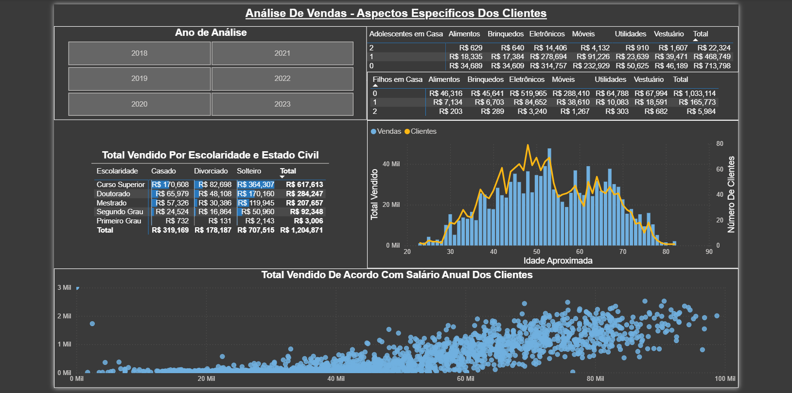

📊 ## **Data Analytics Portfolio**

This repository contains selected data analytics projects using Power BI, SQL, Python, and Excel, focused on transforming raw data into clear insights, dashboards, and decision analysis for real-world scenarios.

🔹 ## **Projects**
📈 ## **Marketing & Sales Analysis — Power BI**

Objective: Build an interactive dashboard to analyze sales performance, customer demographics, and marketing campaign results.

What I did:

- Power BI data modeling (relationships, hierarchies, and DAX measures)
- Power Query data cleaning and transformation
- Multi-dimensional data visualization and filtering

📸 Dashboard preview:

🔗 Project folder:
[marketing_analysis_using_powerBI](marketing_analysis_using_powerBI)

🛒 ## **E-Commerce Analysis — SQL**

Objective: Use SQL queries to extract business insights from an e-commerce dataset.

What I did:

- Cleaned and explored relational data using SQL
- Wrote analytical queries to answer business questions
- Analyzed sales performance across products and customers

📸 Query / result preview:

🔗 Project folder:
[olist_ecommerce_analysis_using_sql](olist_ecommerce_analysis_using_sql)

🧠 ## **Student Data Analysis — Python**

Objective: Analyze student performance data to identify how different factors — such as test preparation — influence scores in math, reading, and writing.

What I did:

- Cleaned and prepared data using Pandas
- Performed exploratory data analysis with visualizations
- Built and evaluated a regression model to analyze the correlation between reading and writing scores.

📸 Visualization preview:

🔗 Project folder:
[student_analysis_using_python](student_analysis_using_python)

🧾 ## **Food Delivery Cost & Profitability Analysis — Excel**

Objective:
Analyze the cost structure and profitability of a food delivery platform, focusing on platform profit drivers, restaurant performance, customer behavior, and delivery efficiency.

What I did:

- Cleaned and prepared raw transactional data using Excel formulas
- Built structured analysis layers (data prep, pivot summaries, dashboards)
- Created pivot tables for restaurant, customer, and platform-level insights
- Designed a management-style dashboard with KPIs and visual summaries

📸 Dashboard preview:

🔗 Project folder:
[platform_performance_analysis_using_Excel](platform_performance_analysis_using_Excel)

🛠 ## **Tools & Skills**

- Power BI (Dashboards, DAX, Power Query)
- SQL (Joins, aggregations, analytical queries)
- Python (Pandas, NumPy, data visualization, basic modeling)
- Excel (Formulas, Pivot Tables, Dashboards, Advanced Filters)

📌 ## **Notes**

- Each project folder contains detailed notebooks, scripts, and explanations
- Projects are designed to reflect realistic analytical workflows
- Focus on clarity, reproducibility, and business-oriented insights

📬 ## **Contact**

- Upwork: https://www.upwork.com/freelancers/~010b23c9000ae004bb?mp_source=share
- LinkedIn: https://linkedin.com/in/alandersong
- GitHub: https://github.com/Alandersong/data_science

