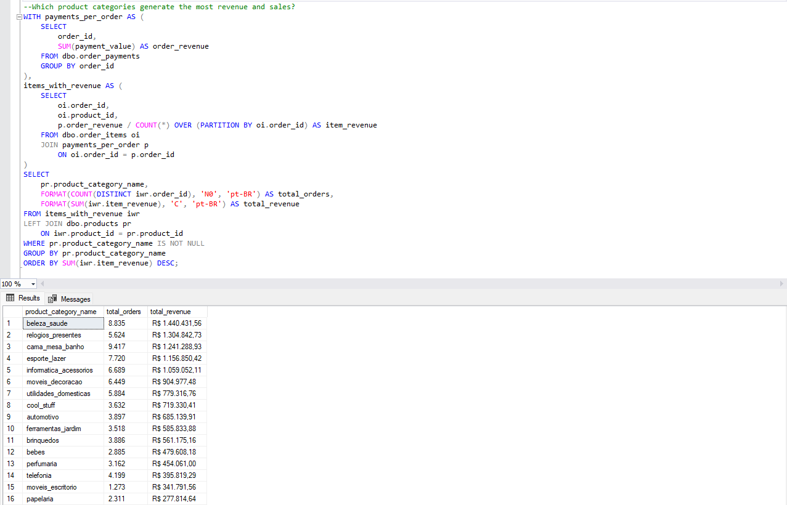

# 🏬 Olist E-Commerce Data Analysis (SQL Server Project)

## 📋 Project Objective
This project analyzes real e-commerce data from the Brazilian marketplace **Olist** using SQL Server.  
The goal is to demonstrate data engineering and analytical skills through:
- Data cleaning and integrity validation  
- Data correction and transformation  
- Business-driven analysis and insights  

The dataset was imported from the public **Olist dataset** on Kaggle and processed in **SQL Server Management Studio 20**.

---

## ⚙️ Tech Stack
| Tool | Purpose |
|------|----------|
| **SQL Server (T-SQL)** | Data import, cleaning, transformation, and analysis |
| **SQL Server Management Studio (SSMS)** | Query development and execution |
| **Kaggle – Olist Dataset** | Public e-commerce dataset |
| **GitHub** | Project version control and portfolio hosting |

---

## 🧹 Data Cleaning & Correction Summary
**Key data issues found and addressed:**
- Removed invalid payments (`payment_value <= 0`)  
- Corrected `payment_installments <= 0` to 1  
- Removed a small number of orders without valid payment references to enforce referential integrity and analytical consistency  
- Verified uniqueness of `(order_id, order_item_id)` and `(order_id, payment_sequential)`  
- Retained `NULL` values for incomplete product records (to preserve truth in data)  
- Confirmed foreign-key integrity between orders, customers, payments, and items  

---

## 💡 Business Questions Answered
1. **What is the total revenue and order count per month?**  
   → Aggregated monthly sales trend and seasonality insights.  

2. **What are the most common payment types, and how do installment patterns affect revenue?**  
   → Identified top payment methods and average installment behavior.  

3. **How long does delivery take from purchase to delivery date, and how has that changed over time?**  
   → Measured average delivery duration per month to track logistics performance.  

4. **Which states and cities generate the most orders and revenue?**  
   → Ranked top-performing regions and customer hubs across Brazil.  

5. **Which product categories contribute most to total sales?**  
   → Highlighted top revenue-generating product types.  

6. **What are Olist’s overall performance metrics?**  
   → Calculated using order-level revenue normalization and delivery-date filtering to ensure accurate aggregation across the dataset.

---

## 📊 Key Results
| Metric | Result (approx.) |
|---------|------------------|
| **Total Orders** | 96,475 |
| **Total Revenue** | ≈ R$ 15.4 million |
| **Average Delivery Time** | ≈ 12 days |
| **Top Payment Type** | Credit card |
| **Top Product Categories** | Health & Beauty, Watches & Gifts, Bed & Bath |
| **Top States by Revenue** | São Paulo (SP), Rio de Janeiro (RJ), Minas Gerais (MG) |

*(Values approximated; derived from the cleaned dataset.)*

---

## 🖼️ Query Result Preview

Below is an example of an analytical SQL query executed in SQL Server, including the resulting output used for business insights:

---

## 🧠 Skills Demonstrated
- **Data cleaning & quality control**: null checks, duplicates, invalid values  
- **Data integrity enforcement**: referential consistency across tables  
- **Transformations**: joins, aggregations, date calculations, CASE logic  
- **Analytical storytelling**: converting raw data into business-ready KPIs  
- **SQL best practices**: comments, logical structure, CTE-based query design  

---

## 🏁 Conclusion
This project showcases a complete SQL data workflow — from importing raw CSVs to delivering clean, insight-driven analytics.  
It reflects skills required for junior data analyst roles and overlaps with entry-level data engineering workflows, including structured querying, data validation, and business insight generation.  

---

## 📫 Author
**Alanderson Guido Oliveira**  

Data Analyst | Power BI, SQL & Python

[LinkedIn](https://www.linkedin.com/in/alandersong) · [GitHub](https://github.com/Alandersong/data_science)

---

## ⚖️ License

This project is shared under the [MIT License](../LICENSE).  

Feel free to use it for learning, portfolio inspiration, or analytics demonstrations.
