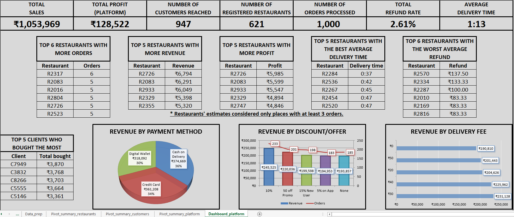

## 📊 **Platform Performance Analysis (Excel)**
## 🔍 **Overview**

This project analyzes **platform cost, revenue, and profitability** using the **“Food Delivery Cost and Profitability”** dataset.
The goal is to demonstrate **end-to-end business analysis in Microsoft Excel**, from raw data to executive-ready dashboards.

The analysis is structured around **real-world stakeholder perspectives**:

- Platform performance
- Restaurant partners
- Customers

---

## 📸 **Dashboard Preview**

**Platform Performance Dashboard**

The dashboard presents high-level KPIs and trends designed for decision-making, focusing on clarity rather than visual overload.

---

## 🚀 **Key Business Questions**

- How profitable is the platform over time?
- What is the financial impact of refunds and discounts?
- Which restaurants contribute most to revenue and refunds?
- How does delivery performance affect customer experience?

---

## 📋 **Dataset**

- Name: Food Delivery Cost and Profitability
- Source: Kaggle (public dataset)
- Granularity: Order-level transactions
- Scope: Revenue, fees, refunds, delivery metrics

---

## 🧰 **Tools & Constraints**

- **Microsoft Excel 2013**
- Formulas & structured tables
- Pivot tables & pivot charts
- Filters (including advanced filtering logic)

No Power Query, XLOOKUP, or modern Excel features were used.

---

## ⚙️ **Workbook Structure**

- **Raw_data** – Original dataset (source of truth)
- **Data_prep** – Cleaning, normalization, calculated metrics
- **Pivot_summary_platform** – Platform-level analysis
- **Pivot_summary_restaurants** – Restaurant performance
- **Pivot_summary_customers** – Customer behavior
- **Dashboard** – Executive-level platform overview

Pivot summary sheets support exploratory analysis; the dashboard focuses on communication and decision-making.

---

## 🧠 **Skills Demonstrated**

- Data cleaning & preparation
- Business metric definition
- Pivot table modeling
- Dashboard design in Excel
- Stakeholder-focused analysis

---

## 📌 **Author**

**Alanderson Guido Oliveira**

Data Analyst | Power BI, SQL, Python & Excel

[LinkedIn](https://www.linkedin.com/in/alandersong) · [GitHub](https://github.com/Alandersong/data_science)

---

## 📜 License

This project is shared under the [MIT License](../LICENSE).  

Feel free to use it for learning, portfolio inspiration, or analytics demonstrations.

