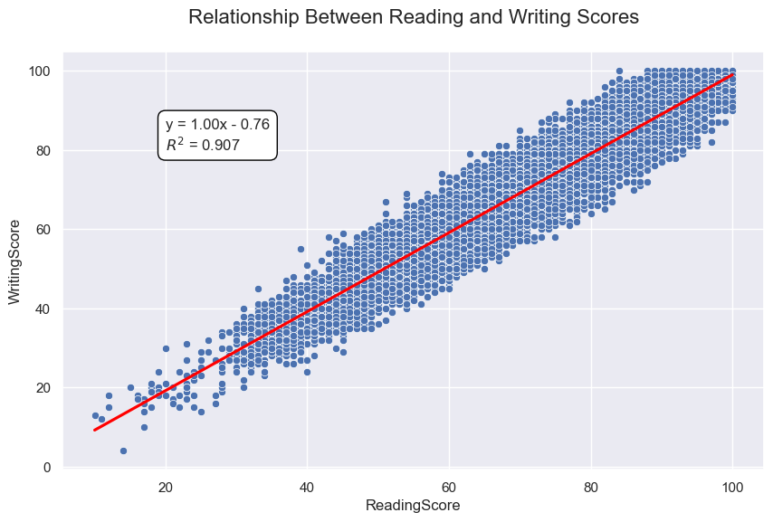

# 📊 Student Performance Analysis using Python

This project explores academic performance data of students using Python. The notebook includes data cleaning, visualization, statistical analysis, and interpretation of key educational patterns. It aims to identify how different factors — such as test preparation — influence scores in math, reading, and writing.

---

## 🔍 Overview

The analysis focuses on:
- Distribution of scores across subjects
- Differences between students who completed a test preparation course and those who didn’t
- Multiple types of charts for deeper insights (e.g., bar chart, pie chart, scatter plot, radar chart)
- Correlation between reading and writing scores
- Linear regression modeling with interpretation (including R² and equation line)

---

## 📌 Tools & Libraries

- `pandas` for data manipulation
- `numpy` for numerical operations
- `seaborn` and `matplotlib` for static visualizations
- `plotly` for interactive charts
- `statsmodels` for linear regression and statistical modeling

---

## 📈 Sample Visualizations

### 📍 Scatter Plot with Regression Line

### 📊 Additional Charts
The notebook includes various other charts such as:
- Bar charts comparing average scores
- Pie chart showing gender distribution
- Radar chart to visualize group performance metrics

---

## 🧠 Key Insights

- Students who completed the test preparation course consistently outperformed others across all subjects.
- Reading and Writing scores show a strong positive correlation, suggesting shared skill dependencies.
- The linear regression model confirms a statistically significant relationship, explaining a high proportion of variance (R²).

---

## 📌 Author

**Alanderson Guido Oliveira**

Data Analyst | Power BI, SQL, Python & Excel

[LinkedIn](https://www.linkedin.com/in/alandersong) · [GitHub](https://github.com/Alandersong/data_science)

---

## 📜 License

This project is shared under the [MIT License](../LICENSE).  

Feel free to use it for learning, portfolio inspiration, or analytics demonstrations.
